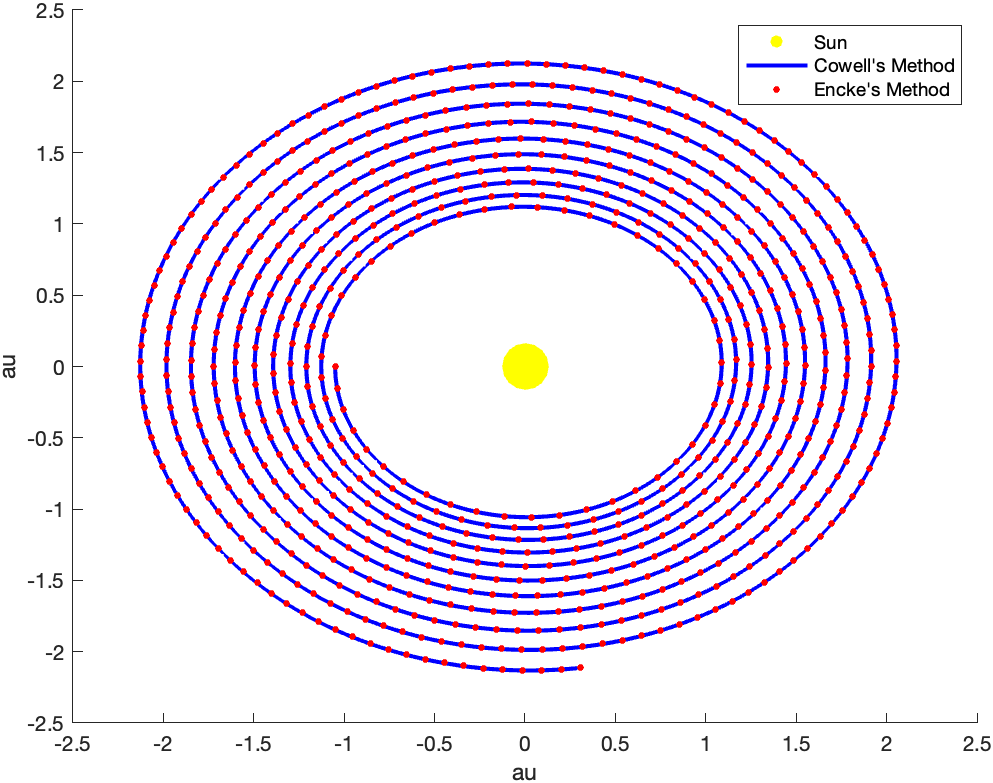
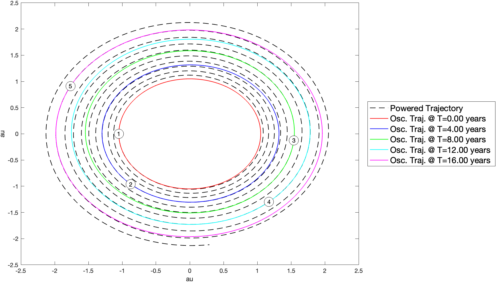
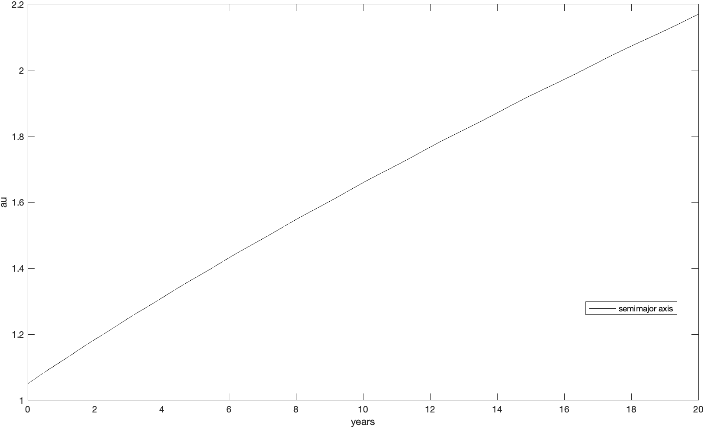
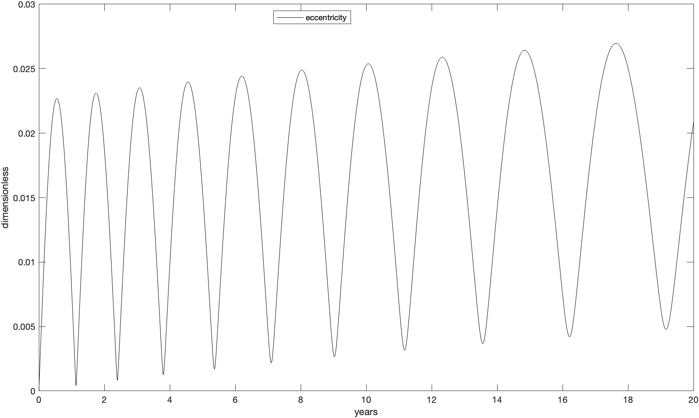

# Propagation of Perturbed Orbits

This project's objective was to propagate the trajectory of a spacecraft orbiting the Sun for 20 years. It compares using Cowell's and Encke's Methods for propagating perturbed orbits, and provides methods for obtaining the osculating orbits.

The spaceship is equipped with an efficient electric propulsion system providing a tangential thrust acceleration $\mathbf{a}$T $= a_{T,0} \left(\frac{1 \ au}{r}\right)^2 \frac{\mathbf{v}}{v}$, where $a_{T,0} = \frac{1}{3}\cdot 10^{-4}$ m/s $^2$ is the thrust's acceleration at 1 au, $r$ the distance to the Sun and $\mathbf{v}/v$ the unit vector along the spacecraft's velocity. It is assumed that the thruster is always active, and that propellant consumption and additional perturbations are negligible (thus $dm/dt = 0$, $\mathbf{a}_d = \mathbf{a}_T$). 

The 2-body perturbed equations of motion are:

$$
\begin{aligned}
\frac{d^2 \mathbf{r}}{dt^2} + \mu\frac{\mathbf{r}}{r^3} = \mathbf{a}_d 
\end{aligned}
$$

where $\mu \in \mathbb R$ is the Sun’s gravitational parameter and and $\mathbf{r}$ the spacecraft's position vector.

## Method & Results
 To solve the problem numerically, the equations of motion were converted to a 1st order ODE by introducing the augmented state vector $\mathbf{x} =[\mathbf{r,v}]$, with time derivative $d{\mathbf{x}}/dt =[v_x,v_y,v_z,a_{d_x}-\frac{\mu r_x}{r^3},a_{d_y}-\frac{\mu r_y}{r^3}, a_{d_z}-\frac{\mu r_z}{r^3}]$.

The initial conditions in the Sun-centred inertial frame were set as $\mathbf{r}$0$=-1.05\mathbf{\hat{i}}$ au and $\mathbf{v}$0 $=-6.1316\mathbf{\hat{j}}$ au/year. Despite the problem being 2D, the codebase supports the propagation of 3D orbits. Propagating forward in time for 20 years using Cowell's Method and Encke's Method leads to the following perturbed trajectory (Sun not to scale):

      

with final state: 
$\mathbf{r}$final $= [0.2910, -2.1152]$ au, $\mathbf{v}$final $= [4.3013, 0.5337]$ au/year.

By converting from position and velocity in the inertial frame to orbital elements (OE), one can obtain the OE of the osculating orbit. An osculating orbit is a Keplerian Orbit tangential to the perturbed orbit at the point in which the OE were calculated, and shows the trajectory that the spacecraft would follow if the perturbations were to suddenly vanish. The osculating orbits of 5 instances along the perturbed trajectory are plotted below:

      

As can be seen below, the semi-major axis $a$ and the eccentricity $e$ of the osculating orbits increase with time:

    
    

The upwards trend can be understood by considering the energy added to the system by raising the orbiting altitude. $e$ oscillates having peaks at apoapsis and troughs at periapsis. As the thrust is always acting along the spacecraft's velocity vector, from periapsis to apoapsis it contributes towards increasing the orbit's $e$, and from apoapsis to periapsis it contributes towards decreasing it.
## Usage

This program can propagate perturbed orbits using either Cowell's Method or Encke's Method. It can also obtain the osculating orbit at any instant along the perturbed trajectory. The initial conditions $\mathbf{r}$0, $\mathbf{v}$0 can be set in the 2nd codeblock. The thrusting acceleration can be altered by changing $\mathbf{a}_{T,0}$ and the `get_at()` function. The duration of the propagation is set in `tf`. Parameters are currently defined in au and years, but these could be easily changed to other units or non-dimensionalized. The relative and absolute tolerance of the integration methods can be changed in the 3rd codeblock. MATLAB's ode45 was used for solving the 1st Order ODE but other methods could be employed by changing lines 24, 65 and 92.
## Disclaimer

This project was developed as part of a coursework for AERO70016 - Orbital Mechanics taught by Dr. Davide Amato and Dr. Rob Hewson (Imperial College London - MEng Aeronautical Engineering).
